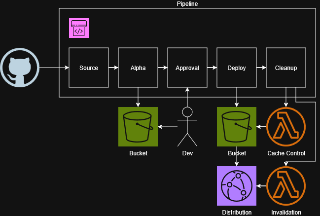

# Static Website CodePipeline

An AWS CodePipeline definition for deploying a static website from a GitHub repository to S3, with a staging environment, manual approval gate, and post-deploy cleanup. Provided in three equivalent IaC flavors: AWS CDK (TypeScript), Terraform, and CloudFormation.

## What It Does

This pipeline automates the deployment of a static site through five stages:

1. **Source** — Pulls the latest code from a GitHub repository via a CodeStar connection.
2. **Alpha** — Deploys the source artifact to a staging S3 bucket for preview.
3. **Approval** — Blocks the pipeline until a human manually approves promotion to production.
4. **Deploy** — Deploys the same source artifact to the production S3 bucket.
5. **Cleanup** — Sequentially invokes two Lambda functions: one to set `Cache-Control` headers on the deployed objects, and one to invalidate the CloudFront distribution cache.

### Diagram

## How I Use This in My Projects

This is the deployment pipeline for my static websites that are backed by S3 + CloudFront. It gives me a staging environment to sanity-check changes before they go live, and the cleanup stage handles the two things S3 deploy actions don't do on their own: setting proper cache headers and busting the CDN cache.

The Cache-Control header application Lambda used in the cleanup stage is defined separately in [`s3-cache-control-header-apply/`](../s3-cache-control-header-apply/) and the CloudFront invalidation Lambda used in the cleanup stage is defined separately in [`cloudfront-distro-invalidator/`](../cloudfront-distro-invalidator/).

## Files

- `pipeline-stack.ts` — AWS CDK (TypeScript)
- `pipeline.tf` — Terraform
- `pipeline.yml` — CloudFormation

All three define the same pipeline. Pick whichever matches your IaC toolchain.

## Prerequisites

These resources must exist before deploying the pipeline:

- A **CodeStar connection** to GitHub (you'll need the ARN).
- Two **S3 buckets**: one for staging, one for production.
- Two **Lambda functions**: one that adds `Cache-Control` headers to objects in the prod bucket, and one that invalidates the CloudFront distribution.
- An **IAM role** for CodePipeline with permissions to pull from CodeStar, deploy to both S3 buckets, and invoke both Lambdas. (The CDK variant creates its own role by default; Terraform and CloudFormation expect you to pass one in.)

## Setup

1. Replace `your-org/your-repo` with your actual GitHub organization and repository name in whichever IaC file you're using.
2. Supply the required parameters/variables for your environment (connection ARN, bucket names, Lambda function names/ARNs, pipeline role ARN).
3. Deploy with your toolchain of choice:
   - **CDK:** `cdk deploy`
   - **Terraform:** `terraform apply`
   - **CloudFormation:** `aws cloudformation deploy --template-file pipeline.yml --stack-name static-site-pipeline --parameter-overrides ...`

## Notes

- The pipeline deploys the raw source artifact — there is no build stage. If your site requires a build step (e.g., Hugo, Jekyll, npm), you'll need to add a CodeBuild stage between Source and Alpha.
- The CDK variant sets `restartExecutionOnUpdate: false`, so updating the pipeline stack won't automatically re-trigger a deployment.
- The Terraform variant creates its own artifact store bucket with `force_destroy = true`. The CloudFormation variant does the same with `DeletionPolicy: Delete`. The CDK variant lets the Pipeline construct manage its own artifact bucket.
- Both Lambdas in the Cleanup stage are invoked with no input artifacts. They're expected to know which bucket/distribution to operate on via their own configuration (environment variables, hardcoded values, etc.).
