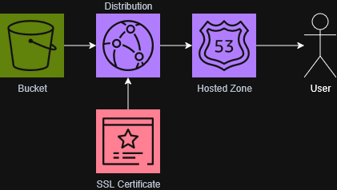

# Static Website Scaffolding

IaC definitions for the foundational infrastructure behind a static website: an S3 bucket with public static hosting, a CloudFront distribution serving the bucket over HTTPS, a Route 53 hosted zone, and an ACM certificate with automated DNS validation. Provided in three equivalent IaC flavors: AWS CDK (TypeScript), Terraform, and CloudFormation.

## What It Does

Each file provisions the same set of resources:

1. **S3 Bucket** — Configured for public static website hosting with `index.html` and `error.html` documents. The bucket is fully public (no OAC), with a bucket policy granting `s3:GetObject` to everyone.
2. **Route 53 Hosted Zone** — A new public hosted zone for the domain. After deployment, you must update your domain registrar's nameservers to the ones output by the stack.
3. **ACM Certificate** — An SSL/TLS certificate in `us-east-1` (required by CloudFront) with DNS validation. Validation records are created automatically in the hosted zone.
4. **CloudFront Distribution** — Serves the S3 website endpoint over HTTPS with the custom domain. Uses the S3 *website* endpoint (not the REST endpoint) as a custom origin over HTTP, so that S3 index/error document routing works correctly.
5. **Route 53 A Record** — An alias record pointing the apex domain to the CloudFront distribution.


### Diagram



## How I Use This in My Projects

This is the base layer for my static sites. It creates the hosting infrastructure that the [`static-website-codepipeline/`](../static-website-codepipeline/) pipeline deploys into. The pipeline handles getting code from GitHub into the S3 bucket; this handles making the bucket reachable at a real domain with HTTPS.

The S3 bucket and CloudFront distribution created here are the same ones that [`s3-cache-control-header-apply/`](../s3-cache-control-header-apply/) and [`cloudfront-distro-invalidator/`](../cloudfront-distro-invalidator/) operate on at the end of each pipeline run — one stamps cache headers on the deployed objects, the other busts the CDN cache.

## Files

- `static-website-stack.ts` — AWS CDK (TypeScript)
- `main.tf` — Terraform
- `static-website.yml` — CloudFormation

All three define the same infrastructure. Pick whichever matches your IaC toolchain.

## Prerequisites

- A **domain name you own**. The IaC creates the hosted zone but does not register the domain.
- **Nameserver update at your registrar.** After the first deploy, you must point your domain's nameservers to the ones Route 53 assigns. This is a manual step that cannot be automated unless the domain is also registered through Route 53.

## Deployment Notes

### Terraform

```sh
terraform init
terraform plan -var="domain_name=example.com"
terraform apply -var="domain_name=example.com"
```

Terraform handles the full dependency chain in a single apply: it creates the hosted zone, writes the ACM validation CNAME, waits for the certificate to validate, then creates the CloudFront distribution and DNS record. However, certificate validation will not complete until Route 53 is authoritative for your domain — so if your nameservers aren't pointed yet, the apply will hang on the `aws_acm_certificate_validation` resource until they are (or until it times out).

### CDK

```sh
cdk deploy -c domainName=example.com
```

Same single-deploy behavior as Terraform. Uses `DnsValidatedCertificate` (deprecated but currently the only CDK construct that handles cross-region cert creation and automatic DNS validation in one shot). If deploying the stack to `us-east-1`, you can swap to a plain `Certificate` with `CertificateValidation.fromDns()`.

### CloudFormation

```sh
aws cloudformation deploy \
  --template-file static-website.yml \
  --stack-name my-static-website \
  --parameter-overrides DomainName=example.com \
  --region us-east-1
```

**This stack must be deployed to `us-east-1`** because CloudFormation cannot create an ACM certificate in a different region from the stack. Unlike Terraform and CDK, CloudFormation's `AWS::CertificateManager::Certificate` resource blocks the entire stack until DNS validation succeeds. If your nameservers aren't pointed when you deploy, the stack will hang until timeout (~1 hour).

Recommended two-phase approach:

1. Deploy with only the S3 bucket and hosted zone (comment out everything below `HostedZone`).
2. Update your registrar's nameservers from the stack output, wait for propagation.
3. Uncomment the remaining resources and deploy again.

## Outputs

All three files export the same values:

| Output | Description |
|--------|-------------|
| Nameservers | The Route 53 nameservers to set at your domain registrar |
| CloudFront Distribution Domain | The `.cloudfront.net` domain (useful for testing before DNS propagates) |
| CloudFront Distribution ID | Needed by [`cloudfront-distro-invalidator/`](../cloudfront-distro-invalidator/) |
| S3 Website Endpoint | The direct S3 endpoint — publicly accessible, bypasses CloudFront |
| Website URL | `https://yourdomain.com` |

## A Note on Public Buckets

This setup uses a public S3 bucket with website hosting enabled. This is the legacy approach. The current AWS best practice is to keep the bucket private and use a CloudFront Origin Access Control (OAC) policy so that all traffic is forced through CloudFront. With a public bucket, anyone can bypass your CDN by hitting the S3 website endpoint directly — skipping your caching, logging, and any WAF rules you add later.